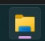
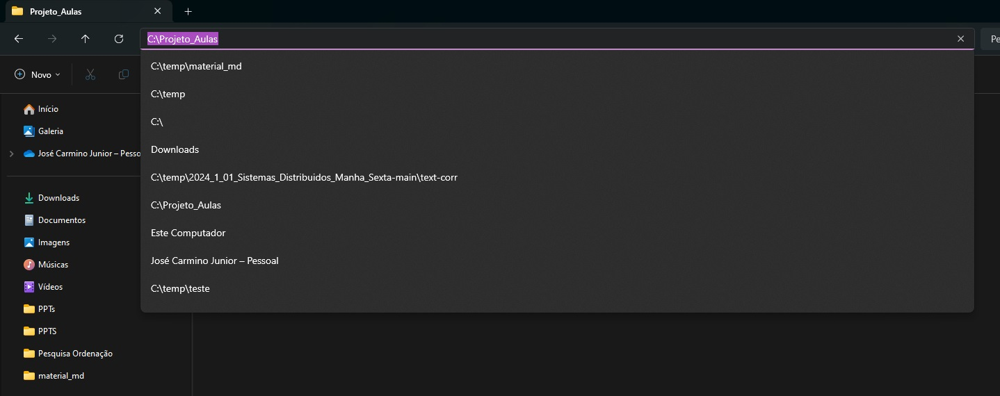
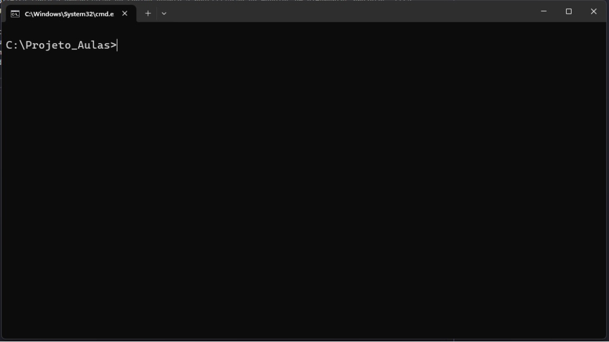
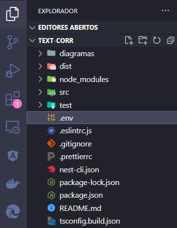

#### Criando uma aplicação com nestjs

# Sobre NestJs

NestJS é um framework progressivo desenvolvido para facilitar a construção de aplicações robustas do lado do servidor utilizando Node.js. Este framework adota o TypeScript como padrão e é fortemente influenciado pela arquitetura modular do Angular, o que simplifica tanto a organização do código quanto a reutilização de módulos em diversos projetos. Essa modularidade torna o NestJS ideal para desenvolvimento escalável e para a manutenção fácil de aplicações empresariais.

Este documento serve como guia para a criação de uma API RESTful utilizando NestJS em conjunto com o TypeORM para a integração com bancos de dados MySQL. Além disso, inclui práticas de segurança como a encriptação de senhas e o uso de JSON Web Tokens (JWT) para a autenticação de login. Seguindo os comandos especificados, você poderá estabelecer uma estrutura básica para seu projeto, configurando um ambiente de desenvolvimento que suporte operações de banco de dados e autenticação de forma segura e eficiente.

No contexto do NestJS, o trabalho assíncrono é uma abordagem que impede o bloqueio do processamento de outras operações enquanto uma tarefa específica não é concluída. Esse modelo é essencial em ambientes de servidor como o Node.js, que opera com eventos e utiliza I/O não bloqueante. O NestJS facilita essa funcionalidade por meio do uso de Promises, async/await e observables do RxJS. Um exemplo disso é a utilização do comando `async` nas funções, permitindo que operações como consultas de banco de dados, chamadas de API ou leituras de arquivos sejam realizadas de forma assíncrona, o que permite que a aplicação continue atendendo a outras solicitações enquanto aguarda a conclusão dessas operações, contribuindo assim para a eficiência e a escalabilidade do serviço.

---

# Executando cmd

Execute o windows explorer e escolha uma pasta para colocar o seu projeto nestjs , selecione a linha correspondente ao nome da pasta no windows explorer e digite cmd que ira carregar o prompt do window, como representado na figura abaixo.


A figura 2 representa a execução do cmd, neste prompt você irá digitar os comando para configuração e criação do seu projeto NestJs


# Preparando o ambiente

Execute os comandos no prompt de comando (CMD) para configurar o seu projeto:

1. `npm install -g @nestjs/cli`

   - Antes de executar este comando verifique se o nest já está instalado com o comando `nest --version`
   - Este comando instala globalmente a Interface de Linha de Comando (CLI) do NestJS por meio do npm, que é o gerenciador de pacotes do Node.js. A CLI facilita diversas tarefas de desenvolvimento no NestJS, como a criação de módulos, controladores, serviços e outros componentes do framework.

2. `nest new nome-do-projeto`

   - `nest`: Comando base para interação com a CLI do NestJS.
   - `new`: Instrui a CLI a criar um novo projeto, configurando toda a estrutura inicial necessária.
   - `nome-do-projeto`: Define o nome do projeto. A CLI cria uma pasta com esse nome, onde todos os arquivos do projeto serão armazenados.
   - vá para a pasta criada usando o comando `cd nome-do-projeto`, é importante estar na pasta do projeto para continuar

3. `npm install @nestjs/typeorm typeorm mysql2`

   - `@nestjs/typeorm`: Pacote que integra o TypeORM, um framework ORM (Object-Relational Mapping), com o NestJS, permitindo o uso eficiente de suas funcionalidades dentro de aplicações NestJS.
   - `typeorm`: Framework ORM necessário para manipular bancos de dados através de entidades e repositórios, evitando consultas SQL diretas.
   - `mysql2`: Driver para MySQL utilizado pelo TypeORM para conectar-se e operar o banco de dados MySQL.

4. `npm install @nestjs/jwt`

   - Instala o módulo `@nestjs/jwt`, usado para implementar funcionalidades relacionadas a JSON Web Tokens (JWTs). JWTs são utilizados para autenticação de usuários e manutenção de sessões em aplicações web, operando de forma segura e stateless.

5. `npm install @nestjs/passport passport passport-jwt bcryptjs`

   - `@nestjs/passport`: Middleware de autenticação para NestJS que facilita a implementação de várias estratégias de autenticação.
   - `passport`: Middleware de autenticação que suporta múltiplas estratégias de autenticação.
   - `passport-jwt`: Estratégia para autenticar usuários com JWTs no Passport.
   - `bcryptjs`: Módulo para criptografar senhas de forma segura antes de armazená-las no banco de dados.

6. `npm install @types/bcryptjs @types/passport-jwt`

   - Instala definições de tipo TypeScript para `bcryptjs` e `passport-jwt` como dependências de desenvolvimento, úteis para assistência durante o desenvolvimento mas não necessárias em produção.

7. `npm install @nestjs/config`

   - Instala o pacote `@nestjs/config`, utilizado para gerenciar variáveis de ambiente em aplicações NestJS.

8. `npm install class-validator`
   - Instala o pacote `class-validator`, que fornece decoradores para validar classes de objetos em tempo de execução de forma simples e declarativa.

9. `npm i @nestjs/mapped-types`
   - Instala o pacote `@nestjs/mapped-types` no projeto. 
   O pacote fornece utilidades que ajudam na criação de tipos derivados de outros tipos, especialmente útil quando se trabalha com classes de Data Transfer Object (DTO). Este pacote permite manipular tipos de classes existentes para criar novos tipos de forma eficiente e segura em termos de tipo, suas principais funcionalidades sáo: 
   - **PartialType**: Cria um novo tipo, fazendo com que todos os campos do tipo original sejam opcionais. É utilizado em cenários onde um DTO de atualização deve ter propriedades opcionais, que não são necessárias para a operação de update.
   - **PickType**: Permite criar um tipo a partir de um tipo existente selecionando um subconjunto de suas propriedades. Isso é útil quando você deseja criar um DTO que inclua apenas algumas propriedades específicas de uma entidade.
   - **OmitType**: Cria um novo tipo omitindo algumas propriedades de um tipo existente. Isso pode ser usado para remover campos que não devem ser expostos através de uma API, por exemplo.
   - **IntersectionType**: Combina dois ou mais tipos criando uma interseção deles. Isso é útil para combinar várias classes de DTO em uma única classe que inclui todas as propriedades das classes base.
   - **ExcludeType**: Semelhante ao `OmitType`, mas trabalha no nível de tipos e não diretamente em classes.
   
   - O uso deste pacote permite manter seu código limpo, evitar duplicação e manter uma forte consistência de tipos em toda a aplicação. Isso facilita a manutenção e o desenvolvimento, pois as mudanças nos tipos de base são automaticamente refletidas nos tipos derivados, reduzindo a possibilidade de erros.

10. `npm install class-transformer`
   - Instala o pacote `class-transformer` é uma biblioteca utilizada principalmente em aplicações TypeScript, para realizar operações de transformação de objetos. Esta biblioteca permite a conversão eficiente de objetos planos JavaScript para instâncias de classes e vice-versa, além de oferecer funcionalidades para a manipulação de dados durante esse processo.

11. `code .`
   - Ao executar o comando `code .`, o VSCode é iniciado junto com todas as suas extensões e configurações personalizadas carregadas. Isso inclui temas, configurações de usuário, extensões instaladas, snippets, e qualquer personalização feita em seu ambiente de desenvolvimento. Este ambiente personalizado faz do VSCode ferramenta para desenvolvedores de software, web designers, e qualquer pessoa que trabalhe com código ou markup languages como HTML, CSS, JavaScript, Python, etc.

---

# Passo 1: Criar o arquivo .env

<table style="width: 100%; border-collapse: collapse; border: none;">
  <tr>
    <td style="width: 10%; border: none;">
      
    </td>
    <td style="width: 50%; border: none;">
      <p>Crie o arquivo <code>.env</code> na raiz do seu projeto, conforme ilustrado na figura 4 (ao lado). O arquivo <code>.env</code> (environment) serve para armazenar variáveis de ambiente de forma segura e organizada, sendo comumente utilizado em projetos de desenvolvimento de software. Este arquivo desempenha um papel crucial ao separar as configurações específicas do ambiente de execução do código-fonte principal. Assim, possibilita que o mesmo código seja operado em diferentes ambientes, como desenvolvimento, teste e produção, sem a necessidade de realizar alterações no código em si. Esse método facilita a gestão das configurações e aumenta a segurança ao manter informações sensíveis, como senhas e chaves API, fora do código versionado.</p>
      <p> As vantagens: 1. Segurança: Ajuda a prevenir o risco de expor dados sensíveis, especialmente quando o código é compartilhado em repositórios públicos. 2. Facilidade de Manutenção: Centraliza as configurações do ambiente, facilitando a alteração dessas variáveis sem a necessidade de buscar por múltiplas partes do código.
      </p>
    </td>
  </tr>
</table>

``` javascript
DB_TYPE=mysql
DB_HOST=localhost
DB_PORT=3306
DB_USERNAME=root
DB_PASSWORD=sua_senha
DB_DATABASE=seu_banco_de_dados
DB_ENTITIES=dist/**/*.entity{.ts,.js}
DB_SYNCHRONIZE=true
```
Cada variável definida no `.env` têm um proposito que são:
- DB_TYPE       :	O tipo do banco de dados. Por exemplo, mysql, postgres, sqlite, etc.
- DB_HOST       :	O endereço do host do servidor do banco de dados (como localhost).
- DB_PORT       :	A porta em que o banco de dados está rodando.
- DB_USERNAME   :	O nome de usuário usado para acessar o banco de dados.
- DB_PASSWORD   :	A senha usada para acessar o banco de dados.
- DB_DATABASE   :	O nome do banco de dados a ser usado.
- DB_ENTITIES   :	Um array de strings que indica onde o TypeORM deve procurar por entidades (modelos). Geralmente aponta para a compilação ou diretórios de código-fonte.
- DB_SYNCHRONIZE: Se configurado como true, o TypeORM tentará sincronizar automaticamente o esquema do banco de dados na inicialização. Isso é útil no desenvolvimento, mas deve ser usado com cautela em produção.
Para ambientes de produção, é recomendado desabilitar a opção synchronize: true no TypeORM, pois isso pode levar a perda de dados ao ajustar entidades

---

# Passo 2 – Criar o módulo de banco de dados

Execute o comando `nest g module database` para criar o módulo `Database`. Após a execução desse comando, o arquivo `app.module.ts` será automaticamente atualizado para incluir a importação do `DatabaseModule`. Essa inclusão configura o NestJS para carregar as definições do TypeORM a partir do `DatabaseModule`, onde as configurações de conexão com o banco de dados serão centralizadas.

Esse módulo será responsável por estabelecer e gerenciar a conexão entre sua aplicação NestJS e o banco de dados, usando o TypeORM como a ponte ORM (Object-Relational Mapping). Para completar a configuração, é essencial inserir o código necessário no `DatabaseModule` para definir essas conexões. Isso geralmente inclui especificar detalhes como o tipo de banco de dados (por exemplo, MySQL, PostgreSQL), o host, a porta, o nome do banco de dados, credenciais de acesso e outras opções de configuração essenciais para a comunicação eficaz e segura com o banco de dados, sendo que estas configurações serão importadas do `.env` criado anteriormente.

Para facilitar a manutenção e a escalabilidade do seu projeto, colocar todas as configurações relacionadas ao banco de dados em um módulo dedicado ajuda a manter o código organizado e claro, permitindo reutilizações e modificações futuras de maneira mais simples e controlada, o código abaixo representa os estado atual do arquivo `database.module.ts`

```javascript 
import { Module, Global } from '@nestjs/common';
import { TypeOrmModule } from '@nestjs/typeorm';
import { ConfigModule, ConfigService } from '@nestjs/config';

@Global()
@Module({
  imports: [
    ConfigModule.forRoot({
      envFilePath: ['.env'],
      isGlobal: true,
    }),
    TypeOrmModule.forRootAsync({
      imports: [ConfigModule],
      inject: [ConfigService],
      useFactory: async (configService: ConfigService) => ({
        type: configService.get<any>('DB_TYPE'),
        host: configService.get<string>('DB_HOST'),
        port: configService.get<number>('DB_PORT'),
        username: configService.get<string>('DB_USERNAME'),
        password: configService.get<string>('DB_PASSWORD'),
        database: configService.get<string>('DB_DATABASE'),
        entities: [configService.get<string>('DB_ENTITIES')],
        synchronize: configService.get<boolean>('DB_SYNCHRONIZE'),
        logging: configService.get<boolean>('DB_LOGGING'),
      }),
    }),
  ],
})
export class DatabaseModule {}
```
O código acima ilustra é a integração do módulo `ConfigModule` do NestJS com o arquivo `.env` para a configuração de uma conexão de banco de dados via `TypeOrmModule`. O `ConfigModule` é usado para carregar variáveis de ambiente do arquivo `.env`, tornando-se globalmente acessível em toda a aplicação. Isso permite que o `TypeOrmModule`, configurado de maneira assíncrona, utilize o `ConfigService` para injetar dinamicamente as configurações de conexão do banco de dados (como tipo de banco, host, porta, usuário, senha, entre outros) diretamente do `.env`. Este método centraliza a gestão de configurações sensíveis e específicas do ambiente, aumentando a segurança e a flexibilidade da aplicação.

---

# Passo 3 - Criar o módulo user

Executo o comando `nest g module user` no prompt (CMD) o que fara com que o nest gere um novo módulo dentro da estrutura de um projeto criado. O uso deste comando ajuda a criação e organização de módulos, que são componentes chave na arquitetura modular do framework.

### O que faz o comando

- **Gera um novo módulo**: Cria um novo módulo chamado `user`, que é um componente destinado a encapsular uma parte específica da lógica da aplicação, neste caso relacionada à gestão de usuários.
- **Organização de código**: Este módulo fica localizado em uma subpasta chamada `user` dentro da pasta `user`, seguindo uma convenção de nomenclatura e estrutura de diretórios que ajuda na organização do projeto.
- **Atualização automática do módulo raiz**: Ao gerar um novo módulo, a CLI do NestJS também atualiza automaticamente o arquivo `app.module.ts`, importando e adicionando o novo módulo `UserModule` à lista de módulos importados, o que facilita a integração e o uso no restante da aplicação.

O arquivo é gerado na pasta `scr/user` com o nome `user.module.ts` e tem o seguinte conteúdo: 

```typescript
import { Module } from '@nestjs/common';

@Module({})
export class UserModule {}
```
# Passo 4 - Criar a entidade `User`

Para criar a entidade `User` no projeto usando TypeORM, execute o comando `nest g class user/entity/user.entity --flat`. Vale ressaltar que uma entidade em TypeORM é uma classe que mapeia para uma tabela de banco de dados no contexto de uma aplicação ORM (Object-Relational Mapping). Esse mapeamento permite que os objetos da aplicação sejam facilmente armazenados e recuperados de um banco de dados de forma que os dados da aplicação possam ser trabalhados com objetos ao invés de comandos SQL diretos.

Após criar a classe com o comando especificado, insira os seguintes atributos dentro do arquivo `user.entity.ts`: `id_user`, `username`, `email` e `senha`. Esses atributos representarão as colunas na tabela `user` do banco de dados MySQL. Cada atributo na entidade é decorado com decoradores TypeORM, como `@Column()`, que ajudam a especificar o tipo de coluna, se é uma chave primária (`@PrimaryGeneratedColumn()`), entre outras características necessárias para o ORM mapear corretamente os dados entre a aplicação e o banco de dados.

Sobre o decorador `@Entity('user')` define uma classe como uma entidade de banco de dados, onde 'user' especifica o nome da tabela no banco de dados à qual a classe estará vinculada, em outras palavras temos que aplicando este decorador a uma classe, ela é transforma na representação de uma tabela no banco de dados, o que permite ao TypeORM gerenciar a criação, recuperação, atualização e exclusão de registros na tabela por meio de objetos da classe. O argumento 'user' no `@Entity()` é opcional e, quando usado, define explicitamente o nome da tabela, que, caso contrário, seria inferido automaticamente com base no nome da classe. 

Não obstante é necessário ter em mente os parâmetros possíveis para o decorator @Column(), que é um dos elementos fundamentais do TypeORM, além de criar a coluna ele define por meio de parâmetros as caracteristicas do atributo, os parâmetros são: 

### **type** 
- Define o tipo de dados da coluna no banco de dados. Os tipos podem variar dependendo do banco de dados utilizado (como `varchar`, `int`, `boolean`, etc.). Se não especificado, o TypeORM tentará inferir o tipo com base no tipo de dado da propriedade na classe.
  ```typescript
  @Column({ type: 'varchar' })
  name: string;
  ```
### **length**
- Especifica o comprimento máximo da coluna, útil para tipos de dados string ou binários.
  ```typescript
  @Column({ length: 100 })
  username: string;
  ```
### **unique**
- Define se a coluna deve ter um valor único entre todas as linhas da tabela.
  ```typescript
  @Column({ unique: true })
  email: string;
  ```
### **nullable**
- Indica se a coluna pode aceitar valores `NULL`. O padrão é `false`, o que significa que a coluna não aceitará valores nulos.
  ```typescript
  @Column({ nullable: true })
  nickname: string;
  ```
### **default**
- Define um valor padrão para a coluna quando nenhum valor é especificado.
  ```typescript
  @Column({ default: 'user' })
  role: string;
  ```
### **primary**
- Indica se a coluna é uma chave primária. Geralmente, se utiliza `@PrimaryColumn()` ou `@PrimaryGeneratedColumn()` para chaves primárias, mas é possível especificar com `@Column()` também.
  ```typescript
  @Column({ primary: true })
  id: number;
  ```
### **comment**
- Permite adicionar um comentário na definição da coluna no banco de dados, o que pode ser útil para documentação.
  ```typescript
  @Column({ comment: 'User email address' })
  email: string;
  ```
### **precision** e **scale**
- Usados para definir a precisão e a escala de colunas numéricas decimais. `Precision` especifica o número total de dígitos, enquanto `scale` define o número de dígitos após a vírgula decimal.
  ```typescript
  @Column({ type: 'decimal', precision: 5, scale: 2 })
  salary: number;
  ```
### **array**
- Indica se a coluna deve ser tratada como um array (suportado em alguns bancos de dados como PostgreSQL).
  ```typescript
  @Column({ type: 'simple-array' })
  preferences: string[];
  ```

Vale ressaltar que os parâmetros podem ser combinados etre si, o que permite um controle detalhado sobre como as propriedades de uma classe mapeada para as colunas de uma tabela em um banco de dados, garantindo a integridade dos dados e otimizando o desenvolvimento da aplicação, abaixo é apresentado o arquivo user.entity.ts


```typescript
import { Entity, PrimaryGeneratedColumn, Column } from 'typeorm';

@Entity('user')
export class User {
    @PrimaryGeneratedColumn()
    id_user: number;

    @Column({ length: 40 })
    nome: string;

    @Column({ unique: true, length: 40 })
    email: string;

    @Column()
    senha: string;
}
```
---
# Passo 5 - Criar a entidade `Filiacao`
Agora vamos criar a entidade chamada `Filiacao`, que representa uma tabela no banco de dados com os atributos especificados, o primeiro passo é gerar a classe da entidade, para tanto execute o comando da CLI do NestJS:

```bash
nest g class user/entity/filiacao.entity --flat 
```

O comando cria um arquivo chamado `filiacao.entity.ts` na pasta `filiacao` dentro do diretório do projeto. Agora, é necessário definir os atributos da entidade `Filiacao` usando os decoradores de TypeORM, especificando os tipos de dados e as restrições de cada campo conforme:

```typescript
import { Entity, PrimaryGeneratedColumn, Column } from 'typeorm';

@Entity('filiacao')
export class Filiacao {
    @PrimaryGeneratedColumn()
    id_perfil: number;

    @Column({ length: 40 })
    nome: string;

    @Column({ length: 40 })
    endereco: string;

    @Column({ length: 30 })
    cidade: string;

    @Column({ length: 30 })
    bairro: string;

    @Column({ length: 2 })
    uf: string;
}
```
---
# Passo 6 - A relação entre `User` e `filicacao`

Para estabelecer uma relação de "um para muitos" entre as entidades `User` e `Filiacao`, é necessário fazer algumas modificações em ambas as classes de entidades. A entidade `User` terá uma relação "um para muitos" com `Filiacao`, significando que um usuário pode ter várias filiações, enquanto cada filiação está associada a um único usuário.

### O que será modificado

1. **Importações**
   - Ambas as classes importam a outra classe de entidade para referenciar nos decoradores de relação. Isso permite que o TypeORM reconheça as entidades relacionadas e configure o banco de dados de acordo.

2. **Decorador `@OneToMany`:**
   - Na classe `User`, adicionamos o decorador `@OneToMany`. Este decorador é usado para definir a relação onde um `User` pode ter muitas `Filiacoes`. O primeiro argumento é uma função que retorna a classe de entidade que está no outro lado da relação. O segundo argumento é uma função que acessa a propriedade inversa na entidade `Filiacao`.

3. **Decorador `@ManyToOne`**
   - Na classe `Filiacao`, usamos o decorador `@ManyToOne`. Este decorador define a relação onde uma `Filiacao` está associada a um único `User`. Semelhante ao `@OneToMany`, ele também usa uma função que retorna a classe de entidade do outro lado, e o segundo argumento é uma função que define a propriedade correspondente na entidade `User`.

##### User Entity (user.entity.ts)
```typescript
import { Entity, PrimaryGeneratedColumn, Column, OneToMany } from 'typeorm'; // foi incluida importação de ManyToOne
import { Filiacao } from './filiacao.entity'; // esta linha foi adicionada

@Entity('user')
export class User {
    @PrimaryGeneratedColumn()
    id_user: number;

    @Column({ length: 40 })
    nome: string;

    @Column({ unique: true, length: 40 })
    email: string;

    @Column()
    senha: string;

    @OneToMany(() => Filiacao, filiacao => filiacao.user) // esta linha foi adicionada
    filiacoes: Filiacao[];                                // esta linha foi adicionada
}
```

##### Filiacao Entity (filiacao.entity.ts)
```typescript
import { Entity, PrimaryGeneratedColumn, Column, ManyToOne } from 'typeorm'; // foi incluida importação de ManyToOne
import { User } from './user.entity'; // esta linha foi adicionada

@Entity('filiacao')
export class Filiacao {
    @PrimaryGeneratedColumn()
    id_perfil: number;

    @Column({ length: 40 })
    nome: string;

    @Column({ length: 40 })
    endereco: string;

    @Column({ length: 30 })
    cidade: string;

    @Column({ length: 30 })
    bairro: string;

    @Column({ length: 2 })
    uf: string;

    @ManyToOne(() => User, user => user.filiacoes) // esta linha foi adicionada
    user: User;                                    // esta linha foi adicionada
}
```
---
# Passo 7 - Modificando user.module

Este é o conteúdo do arquivo `user.module.ts`, que define um módulo que conteá a integração do módulo user.

``` typescript 

import { Module } from '@nestjs/common';

@Module({})
export class UserModule {}
``` 
Modificações necessárias para integração 

Importações Adicionais
1. import { TypeOrmModule } from '@nestjs/typeorm';
- Esta linha importa o TypeOrmModule do pacote @nestjs/typeorm, a integração permite mapear as classes de entidades a tabelas de banco de dados.
- import { User } from './entity/user.entity';
- A importação traz a entidade User, para ser usada no módulo.

3. Uso do TypeOrmModule.forFeature([User, Filiacao])
TypeOrmModule.forFeature([User, Filiacao]) é adicionado ao array imports no decorador @Module. Este método é usado para registrar a entidade User (e quaisquer outras entidades listadas) no escopo do módulo User. Isso significa que User pode ser injetada em serviços que fazem parte deste módulo, permitindo operações de banco de dados como inserções, atualizações, consultas e deleções diretamente relacionadas à tabela user.

Arquivo `user.module.ts` atualizado com as importações
``` typescript
import { Module } from '@nestjs/common';
import { AppController } from './app.controller';
import { AppService } from './app.service';
import { DatabaseModule } from './database/database.module';
import { User } from './user/entity/user.entity';
import { Filiacao } from './user/entity/filiacao.entity';
import { TypeOrmModule } from '@nestjs/typeorm';

@Module({
  imports: [
    DatabaseModule,
    TypeOrmModule.forFeature([User, Filiacao]),
  ],
  controllers: [AppController],
  providers: [AppService],
})
export class UserModule {}
```
# Passo 8 - Criando os DTOs

DTOs, ou Data Transfer Objects, são estruturas utilizadas em programação para transferir dados entre diferentes camadas de uma aplicação, especialmente em arquiteturas como a de um serviço web ou microserviços. O principal propósito de um DTO é encapsular os dados em um formato simples e otimizado para a transferência, normalmente sem lógica de negócios embutida, facilitando a serialização e deserialização de dados entre o cliente e o servidor.

Tais objetos são úteis porque permitem um controle detalhado sobre o formato e o conteúdo da informação que é exposta nas interfaces de programação de aplicações (APIs). Ao usar DTOs, é possível personalizar os dados enviados para os clientes ou recebidos do servidor, garantindo que apenas os dados relevantes sejam incluídos na comunicação, o que pode melhorar a eficiência da aplicação e aumentar a segurança, evitando a exposição de dados internos ou sensíveis.

Execute o comando para crir o user.dto: 

```bash
nest g class user/dto/user.dto --flat 
```

Insira o código abaixo 

```typescript 
import { IsEmail, IsString, Length, Matches } from 'class-validator';

import { PartialType } from '@nestjs/mapped-types';

export class CreateUserDto {
  @IsString()
  @Length(8, 40, { message: 'o tamanho minimo do nome é 8 caracteres' })
  nome: string;

  @IsEmail()
  @Length(8, 40, { message: 'o tamanho minimo do e-mail é 8 caracteres' })
  email: string;

  @IsString()
  @Matches(/^(?=.*[a-z])(?=.*[A-Z])(?=.*\d)(?=.*[\W_]).{8,}$/, {
    message:
      'a senha deve ter pelo menos 8 caracteres, incluindo uma pelo menos: uma letra maiúscula, uma letra minúscula, um número e um caractere especial',
  })
  senha: string;
}

export class UpdateUserDto extends PartialType(CreateUserDto) {}
```
O código usa o pacote `class-validator` para validação de dados e o `@nestjs/mapped-types` para manipulação de tipos no projeto

- **`IsEmail, IsString, Length, Matches`**: Estes são decoradores de validação fornecidos pelo pacote `class-validator`.
- **`PartialType`**: Importado de `@nestjs/mapped-types`, que é usado para criar um tipo derivado de um outro tipo, tornando todas as propriedades do tipo original opcionais. 
- **`@IsString()`**: Este decorador garante que o valor do campo deve ser uma string. É usado aqui para os campos `nome` e `senha`.
- **`@Length(min, max, options)`**: Define o comprimento mínimo e máximo para o valor do campo. Para o campo `nome`, ele verifica se o nome tem entre 1 e 40 caracteres, mas a mensagem de erro contradiz com o mínimo especificado (`8 caracteres` deveria ser `1 caracter` como especificado no decorador). Para `email`, ele estabelece que o email deve ter entre 8 e 40 caracteres.
- **`@IsEmail()`**: Verifica se o campo `email` é um endereço de e-mail válido.
- **`@Matches(regex, options)`**: Este decorador usa uma expressão regular para validar o campo `senha`. A expressão regular exige que a senha tenha pelo menos 8 caracteres e inclua pelo menos uma letra minúscula (`[a-z]`), uma maiúscula (`[A-Z]`), um número (`\d`) e um caractere especial (`[\W_]`).

Execute o comando para criar o filiacao.dto: 

```bash
nest g class user/dto/filiacao.dto --flat 
```

Insira o código abaixo 

```typescript
import { IsString, Length, IsInt } from 'class-validator';
import { PartialType } from '@nestjs/mapped-types';

export class CreateFiliacaoDto {
  @IsString()
  @Length(8, 40, { message: 'o tamanho minimo do nome é 8 caracteres' })
  nome: string;

  @IsString()
  @Length(12, 40, { message: 'o tamanho minimo do endereço é 12 caracteres' })
  endereco: string;

  @IsString()
  @Length(8, 30, { message: 'o tamanho minimo do cidade é 8 caracteres' })
  cidade: string;

  @IsString()
  @Length(8, 30, { message: 'o tamanho minimo do bairro é 8 caracteres' })
  bairro: string;

  @IsString()
  @Length(2, 2, { message: 'o tamanho minimo do nome é 2 caracteres' })
  uf: string;

  @IsInt()
  userId: number;
}

export class UpdateFilicacaoDto extends PartialType(CreateFiliacaoDto) {}

```

---

# Passo 9 - Executando o projeto

Em engenharia de software, os termos "ambiente de desenvolvimento" e "ambiente de produção" designam dois estágios cruciais no ciclo de vida de desenvolvimento e implantação de software. Cada um desses ambientes possui finalidades, configurações e características específicas que são alinhadas com distintas fases do desenvolvimento e utilização do software.

**Ambiente de Desenvolvimento:**
Trata-se do cenário onde os desenvolvedores criam e testam o software. Este ambiente inclui, normalmente, ferramentas integradas de desenvolvimento, como editores de código, sistemas de controle de versão e ambientes de desenvolvimento local (IDEs). Nele, os desenvolvedores dispõem de total liberdade para escrever código, experimentar e conduzir testes preliminares. As configurações são especialmente ajustadas para simplificar a depuração e os testes, não priorizando a performance ou a segurança. A implementação constante de novas funcionalidades e frequentes mudanças são aspectos típicos deste ambiente.

**Ambiente de Produção:**
Este é o ambiente no qual o software é finalmente colocado em uso real pelos usuários finais, após ser extensivamente testado em ambientes de teste e/ou homologação. O ambiente de produção precisa ser extremamente seguro, estável e otimizado para performance, visto que qualquer falha pode impactar diretamente os usuários, acarretando perdas de dados, tempo, reputação e/ou receita. Caracterizado pela sua estabilidade, neste ambiente as alterações são cuidadosamente controladas e frequentemente automatizadas por meio de processos de integração contínua e entrega contínua (CI/CD) para reduzir riscos de interrupções ou falhas.

**Transição entre Ambientes:**
A transição do ambiente de desenvolvimento para o de produção normalmente passa por múltiplos estágios intermediários, que incluem ambientes de teste e de homologação, onde o software é sujeito a testes ainda mais rigorosos. Estes testes buscam replicar o ambiente de produção o mais fielmente possível para assegurar que qualquer erro seja detectado e corrigido antes do lançamento oficial.

Após desenvolver as entidades `User` e `Filiacao` e estabelecer suas relações, é vital executar o código para verificar como essas configurações são aplicadas no banco de dados MySQL. Inicie este processo executando a aplicação NestJS com o comando `npm run start:dev`, que ativa o ambiente de desenvolvimento. A sincronização automática (`synchronize: true`) nas configurações do TypeORM facilitará a criação ou atualização das tabelas necessárias. Entretanto, em ambientes de produção, recomenda-se o uso de migrações para gerenciar as versões do banco de dados, oferecendo maior controle e segurança sobre as mudanças efetuadas. Após executar o aplicativo, use ferramentas como MySQL Workbench ou a linha de comando para verificar se as tabelas `user` e `filiacao` foram criadas adequadamente e se a relação entre elas foi configurada corretamente, validando a integridade referencial entre as chaves.

---
